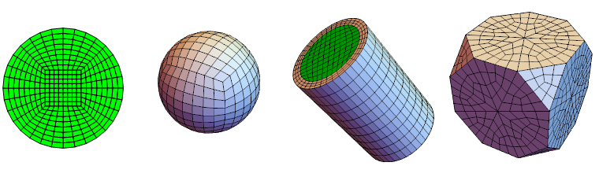

# MeshTools

[](http://github.com/c3m-labs/MeshTools/releases)
[](http://semver.org/spec/v2.0.0.html)

_MeshTools_ is a [Mathematica](http://www.wolfram.com/mathematica/) package for creating and manipulating
meshes for finite element method (`ElementMesh` objects). It helps you to do the following tasks:

* Create structured meshes in 2D and 3D
* Split, transform and merge meshes
* Convert triangular to quadrilateral mesh
* Create high quality meshes on basic geometric shapes



## Installation

The following installation guidelines are meant for people who just want to use the package functionality.
If you would like to build the package from the source code see the "Contributing" section of this document.
This package requires Mathematica version 11. or later.

_MeshTools_ package is released in the `.paclet` file format, which contains code,
documentation and other necessary resources.
Download the latest `.paclet` file from the
repository ["releases"](https://github.com/c3m-labs/MeshTools/releases) page
to your computer and install it by evaluating the following command in the Mathematica:

```mathematica
(* This built-in package is usually loaded automatically at kernel startup. *)
Needs["PacletManager`"]

(* Path to .paclet file downloaded from repository "releases" page. *)
PacletInstall["full/path/to/MeshTools-X.Y.Z.paclet"]
```

This will permanently install the _MeshTools_ package to `$UserBasePacletsDirectory`.
To update the documentation it may be necessary to restart Mathematica.
Mathematica will always use the latest installed version of package and all installed versions
can be enumerated by evaluating `PacletFind["MeshTools"]`.
You can get more detailed information about the package with `PacletInformation["MeshTools"]`.
All versions can be uninstalled with:

```mathematica
PacletUninstall["MeshTools"]
```

## Usage

After you have installed the paclet, load it to Mathematica session with `Needs`.
Then you can, for example, make a `ElementMesh` object from basic geometric shape and visualize it.

```mathematica
Needs["MeshTools`"]

outerMesh = AnnulusMesh[{0, 0}, {2/3, 1}, {0, 3 Pi/2}, {24, 4}];
innerMesh = AnnulusMesh[{0, 0}, {1/2, 2/3}, {0, 3 Pi/2}, {24, 2}];
mesh = MergeMesh[{
    AddMeshMarkers[outerMesh, "MeshElementsMarker" -> 1],
    AddMeshMarkers[innerMesh, "MeshElementsMarker" -> 2]
}];

mesh["Wireframe"[
    "MeshElementStyle" -> FaceForm /@ {ColorData[112, 3], ColorData[112, 2]}]
]
```


To access the documentation, open the notebook interface help viewer and search for "MeshTools".

## Contributing and feedback

Please use the repository ["issues"](https://github.com/c3m-labs/MeshTools/issues) page to submit bugs or feature ideas. If you find this package useful, feel free to send us feedback by email to `github(at)c3m.si`.

Pull requests to this repository are welcome.
Guidelines on how to build `.paclet` file from the source code can be found in [CONTRIBUTING.md]( CONTRIBUTING.md ) file.

## License

[MIT](https://choosealicense.com/licenses/mit/)
